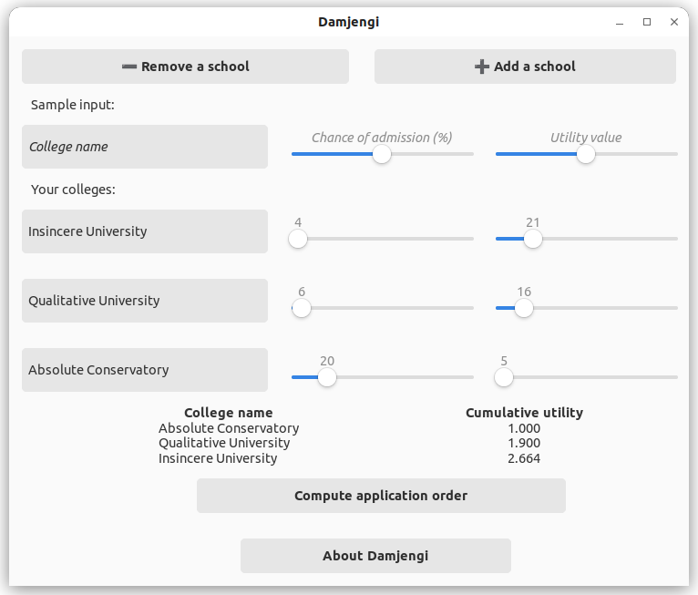

# Damjengi
… is a graphical college application strategist for GNU/Linux built using 
GTK and Python. 

You input estimates of your admissions chances at each school and 
the amount of utility you associate with going there, 
and Damjengi sorts the schools in the order you should apply
to them in order to maximize your expected payoff.

The underlying algorithm is described in my [MS thesis](https://github.com/maxkapur/CollegeApplication). 

## Usage

Here’s an example:

In this example, we have three schools: Insincere University with a 4% chance of admission and utility value of 21, Qualitative University with a 6% chance of admission and utility value of 16, and Absolute Conservatory with a 20% change of admission and utility value of 5. Relatively speaking, Absolute Conservatory is a “safety school” while the others are “reach schools.”

The output sorts the schools in the order Absolute Conservatory, Qualitative University, Insincere University. This means that if you only have time to apply to one college, it should be Absolute Conservatory, and if you can only apply to two colleges, you should pick Absolute Conservatory and Qualitative University. The **Cumulative utility** column tells you the expected utility associated with that school and the schools above it. 

## Installation

You can run Damjengi by cloning the repo and running
`python3 Damjengi.py` from the repo directory. You may need to install some GTK dev tools.

## Bugs, questions, comments

Submit a PR on GitHub or email me at [maxkapur@gmail.com](mailto:maxkapur@gmail.com).
